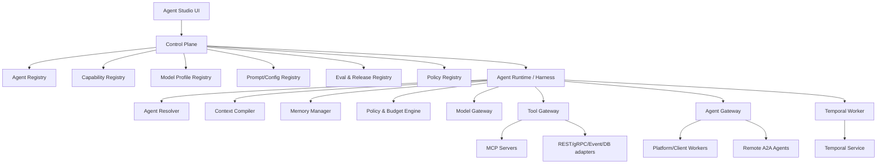

# 02 — Architecture

## Planes
**Control Plane:** configuration, discovery, lifecycle and governance; no agent business-workload execution.  
**Execution Plane:** Harness, gateways, workers and runtime adapters.  
**Capability/Data Plane:** MCP servers, APIs, DB/search/event adapters and enterprise systems.  
**Durable Orchestration Plane:** Temporal service/workers.

## Key abstractions
- `AgentDefinition`: mutable logical agent draft.
- `AgentVersion`: immutable executable version.
- `AgentRuntimeAdapter`: executes an AgentVersion.
- `Capability`: logical callable business capability.
- `CapabilityProvider`: concrete MCP/API/agent implementation.
- `ModelProfile`: logical model requirements/policy.
- `ExecutionContext`: tenant/subject/scopes/run/deadline/budget/classification.
- `Run`, `Task`, `Artifact`, `ToolInvocation`.

## Invocation rule
All governed cross-boundary calls use gateways: Agent -> Model Gateway; Agent -> Tool Gateway; Agent -> Agent Gateway. Agents do not select arbitrary network addresses.

## Framework neutrality
Embabel code exists only in `runtime-embabel`. Python frameworks use the internal invocation protocol. A2A exists only at the adapter edge.

## Portability
Use Kubernetes, PostgreSQL, Redis-compatible cache, object-storage abstraction, OIDC/OAuth2 and OpenTelemetry. Provider-specific features are adapters.
